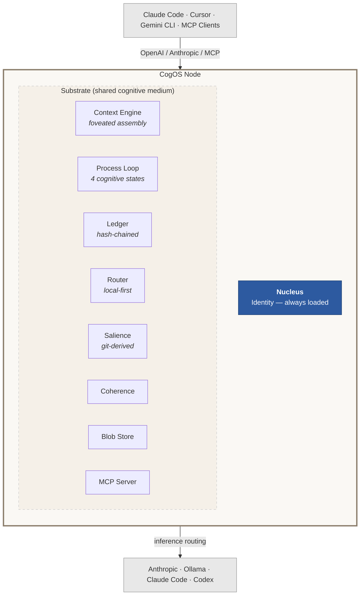

# CogOS

**Cognitive infrastructure for AI agents.** Memory, context, identity, and trust — as a daemon.

CogOS is a background kernel that gives AI agents the things they can't give themselves: persistent memory that survives across sessions, context assembly that knows what matters right now, multi-provider inference routing that keeps data local, and a tamper-evident ledger that records every decision. It runs on your hardware, it works with any agent, and everything it knows stays yours.

```sh
make build
./cogos init --workspace ~/my-project
./cogos serve --workspace ~/my-project
```

## The problem

AI agents are stateless. Every session starts from zero. You re-explain context. The agent re-reads files it already understood yesterday. If you use Claude Code in the morning and Cursor in the afternoon, neither knows what the other did. There's no shared memory, no continuity, no identity.

CogOS sits underneath all of them and provides what they can't provide for themselves.

## What happens when you install it

**Day 1:** Your agent remembers things you didn't tell it to remember. Context it surfaces feels right — it knows which files matter because it watches your git history, not just your current message.

**Day 3:** Conversations get shorter. You're spending fewer tokens because the system understands what you mean, not just what you say. The compression comes from shared context that accumulates without effort.

**Week 1:** You stop noticing it. That's the point. The agent just knows things. The workspace has continuity. You open a new session and it already has the thread.

## Architecture

CogOS is structured like a cell, not a stack. Components (organelles) float in a shared cognitive substrate and coordinate through it — not through direct imports or message passing. The membrane controls what crosses the boundary.



The kernel runs as a continuous process with four states — **Active** (processing a request), **Receptive** (idle, maintaining the attentional field), **Consolidating** (internal maintenance), and **Dormant** (heartbeat only). It's always aware of what changed, even between sessions.

Organelles don't communicate directly. They read from and write to the substrate. Adding a new component requires zero changes to existing ones — it just starts participating in the shared medium.

## Core ideas

### Your workspace is the cognitive object, not the model

Most agent frameworks treat the model as the brain and bolt memory on the side. CogOS inverts this: the workspace is the persistent cognitive substrate. Models are organs — swappable, upgradeable, transient. Identity and memory live in the workspace and survive any model change.

### Context should be assembled, not stuffed

Instead of dumping everything into the context window, the engine scores every available piece of context and arranges it into stability zones optimized for KV cache reuse:

| Zone | Contents | Stability |
|------|----------|-----------|
| 0 — Nucleus | Identity | Always present, never evicted |
| 1 — Knowledge | Workspace docs, indexed memory | Shifts slowly, high cache hit rate |
| 2 — History | Conversation turns | Scored by relevance, evictable |
| 3 — Current | The current message | Always present |

### Local first, cloud as fallback

The router scores providers on a sovereignty gradient. Local models (Ollama) are preferred. Cloud APIs are fallbacks, not defaults. Your data stays on your hardware unless you explicitly say otherwise.

### Every decision is recorded

The ledger is append-only, hash-chained (SHA-256, RFC 8785), and complete. Every routing decision, every context assembly, every state transition. Tamper-evident and causally ordered. Not for compliance theater — for understanding why the system did what it did.

### It works with what you already have

CogOS doesn't replace your tools. It sits behind them. Any OpenAI-compatible client, any Anthropic Messages client, any MCP-capable agent can connect. Claude Code, Cursor, Gemini CLI, custom agents — they all talk to the same kernel, share the same memory, benefit from the same context.

## Quick start

```sh
# Clone and build
git clone https://github.com/cogos-dev/cogos.git
cd cogos
make build

# Initialize a workspace
./cogos init --workspace ~/my-project

# Start the daemon
./cogos serve --workspace ~/my-project

# Verify
curl -s http://localhost:5200/health | jq .
```

### Developer setup

```sh
./scripts/setup-dev.sh    # Build, install to ~/.cogos/bin, configure PATH
```

### Docker

```sh
make e2e          # Build + run full cold-start test in a container
make image        # Build production image
make run          # Run with workspace volume mount
```

## API

| Endpoint | What it does |
|----------|-------------|
| `POST /v1/chat/completions` | OpenAI-compatible chat (streaming + non-streaming) |
| `POST /v1/messages` | Anthropic Messages-compatible chat |
| `POST /v1/context/foveated` | Foveated context assembly |
| `GET /v1/context` | Current attentional field |
| `GET /health` | Liveness probe with identity, state, trust |
| `POST /mcp` | MCP Streamable HTTP endpoint |

## Providers

Ships with Anthropic, Ollama, Claude Code, and Codex. New providers implement [six methods](docs/writing-a-provider.md) — same extensibility pattern as Terraform providers.

## Project layout

```
cmd/cogos/              Entry point
internal/engine/        Kernel (90 source files, 33 test files)
docs/                   Specs and guides
scripts/                Setup, CLI, and e2e tests
```

## Testing

```sh
make test         # Unit tests
make e2e-local    # Full cold-start lifecycle test
make e2e          # Containerized e2e
```

## Status

v3 kernel — ground-up rewrite after a year of daily use across multiple agent harnesses.

Working: continuous process, foveated context, hash-chained ledger, multi-provider routing, MCP server, blob store, salience scoring, OpenAI/Anthropic compatibility, workspace scaffolding, e2e testing, web dashboard, OpenTelemetry.

Next: memory consolidation loop, multi-agent process management, identity and trust module, `cog` CLI.

## Deeper

- [System Specification](docs/vision/distributed-presence-and-trust.md) — multi-device presence, learned boundaries, trust membrane
- [Writing a Provider](docs/writing-a-provider.md) — extensibility guide
- [MCP Specification](docs/MCP-SPEC.md) — MCP server contract
- [Provider Specification](docs/PROVIDER-SPEC.md) — provider interface contract

## Requirements

- Go 1.24+
- macOS or Linux

## License

MIT
