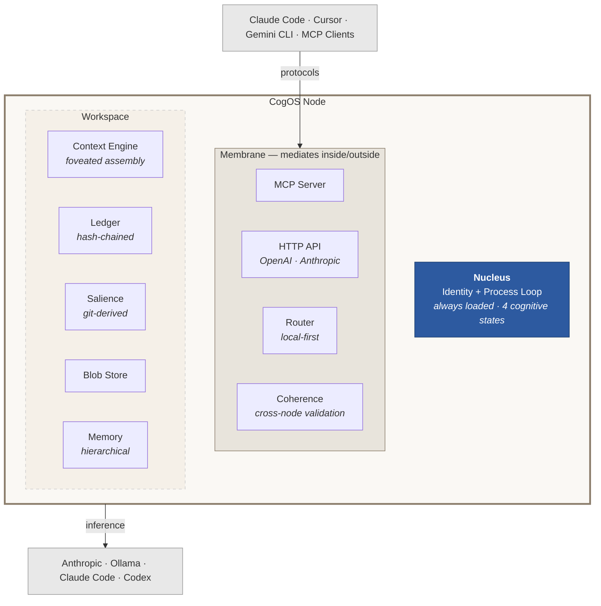

# CogOS

**Cognitive infrastructure for AI agents.** Memory, context, identity, and trust — as a daemon.

CogOS is a background kernel that gives AI agents the things they can't give themselves: persistent memory that survives across sessions, context assembly that knows what matters right now, multi-provider inference routing that keeps data local, and a tamper-evident ledger that records every decision. It runs on your hardware, it works with any agent, and everything it knows stays yours.

```sh
make build
./cogos init --workspace ~/my-project
./cogos serve --workspace ~/my-project
```

## The problem

AI agents are stateless. Every session starts from zero. You re-explain context. The agent re-reads files it already understood yesterday. If you use Claude Code in the morning and Cursor in the afternoon, neither knows what the other did. There's no shared memory, no continuity, no identity.

CogOS sits underneath all of them and provides what they can't provide for themselves.

## What happens when you install it

**Day 1:** Your agent remembers things you didn't tell it to remember. Context it surfaces feels right — it knows which files matter because it watches your git history, not just your current message.

**Day 3:** Conversations get shorter. You're spending fewer tokens because the system understands what you mean, not just what you say. The compression comes from shared context that accumulates without effort.

**Week 1:** You stop noticing it. That's the point. The agent just knows things. The workspace has continuity. You open a new session and it already has the thread.

## Architecture

CogOS is structured like a cell, not a stack. The system has three zones — the **nucleus** (identity and process loop), the **workspace substrate** (memory, ledger, context), and the **membrane** (APIs, routing, and coherence that mediate between inside and outside). Components within each zone coordinate through the shared substrate, not through direct connections.



**Nucleus:** The identity core and process loop — defines the node. Always loaded, runs continuously through four states (Active, Receptive, Consolidating, Dormant). The identity is not static — it changes by being read, like DNA that's transcribed and updated through use.

**Workspace:** The cognitive substrate where memory, ledger, context, and salience live. Workspace-scoped — switch workspaces and these components operate on different data. A node can host multiple workspaces. A workspace can span multiple nodes via the [Constellation Protocol](https://github.com/cogos-dev/constellation).

**Membrane:** The semipermeable boundary. MCP server, HTTP API, router, and coherence validator sit here — mediating between the internal substrate and external systems. The membrane controls what crosses the boundary in both directions.

Organelles don't communicate directly. They read from and write to the substrate. Adding a new component requires zero changes to existing ones.

## Ecosystem

CogOS is not a monolith. Each subsystem is its own repo, its own release cycle, its own organelle:

| Repo | Role | What it does |
|------|------|-------------|
| [cogos-dev/cogos](https://github.com/cogos-dev/cogos) | Kernel | Continuous process daemon — context, memory, ledger, routing |
| [cogos-dev/constellation](https://github.com/cogos-dev/constellation) | Identity & Trust | Distributed identity where trust is earned through temporal consistency |
| [cogos-dev/mod3](https://github.com/cogos-dev/mod3) | Modality | Multi-model TTS with adaptive playback, VAD, and speech queuing |

Each organelle is independently deployable. They coordinate through the substrate, not through imports. The workspace discovers available organelles at runtime through capability scanning — like a cell discovering what enzymes are available in the cytoplasm.

## Core ideas

### Your workspace is the cognitive object, not the model

Most agent frameworks treat the model as the brain and bolt memory on the side. CogOS inverts this: the workspace is the persistent cognitive substrate. Models are organs — swappable, upgradeable, transient. Identity and memory live in the workspace and survive any model change.

### Context should be assembled, not stuffed

Instead of dumping everything into the context window, the engine scores every available piece of context and arranges it into stability zones optimized for KV cache reuse:

| Zone | Contents | Stability |
|------|----------|-----------|
| 0 — Nucleus | Identity | Always present, never evicted |
| 1 — Knowledge | Workspace docs, indexed memory | Shifts slowly, high cache hit rate |
| 2 — History | Conversation turns | Scored by relevance, evictable |
| 3 — Current | The current message | Always present |

### Identity is earned, not assigned

The [Constellation Protocol](https://github.com/cogos-dev/constellation) defines identity as a dynamical property — coherence with history — not a static credential. Nodes earn trust through consistent behavior over time. Stolen keys can't impersonate because trust is coupled to history. Verification is O(1) per peer — no global consensus needed.

### Local first, cloud as fallback

The router scores providers on a sovereignty gradient. Local models (Ollama) are preferred. Cloud APIs are fallbacks, not defaults. Your data stays on your hardware unless you explicitly say otherwise.

### Every decision is recorded

The ledger is append-only, hash-chained (SHA-256, RFC 8785), and complete. Every routing decision, every context assembly, every state transition. The information lives in the delta between states — the ledger records only moments where something changed.

### It works with what you already have

CogOS doesn't replace your tools. It sits behind them. Any OpenAI-compatible client, any Anthropic Messages client, any MCP-capable agent can connect. Claude Code, Cursor, Gemini CLI, custom agents — they all talk to the same kernel, share the same memory, benefit from the same context.

## Quick start

```sh
# Clone and build
git clone https://github.com/cogos-dev/cogos.git
cd cogos
make build

# Initialize a workspace
./cogos init --workspace ~/my-project

# Start the daemon
./cogos serve --workspace ~/my-project

# Verify
curl -s http://localhost:6931/health | jq .
```

### Developer setup

```sh
./scripts/setup-dev.sh    # Build, install to ~/.cogos/bin, configure PATH
```

### Docker

```sh
make e2e          # Build + run full cold-start test in a container
make image        # Build production image
make run          # Run with workspace volume mount
```

## API

| Endpoint | What it does |
|----------|-------------|
| `POST /v1/chat/completions` | OpenAI-compatible chat (streaming + non-streaming) |
| `POST /v1/messages` | Anthropic Messages-compatible chat |
| `POST /v1/context/foveated` | Foveated context assembly |
| `GET /v1/context` | Current attentional field |
| `GET /health` | Liveness probe with identity, state, trust |
| `POST /mcp` | MCP Streamable HTTP endpoint |

## Providers

Ships with Anthropic, Ollama, Claude Code, and Codex. New providers implement [six methods](docs/writing-a-provider.md) — same extensibility pattern as Terraform providers.

## Project layout

```
cmd/cogos/              Entry point
internal/engine/        Kernel (90 source files, 33 test files)
docs/                   Specs, guides, and architecture diagrams
scripts/                Setup, CLI, and e2e tests
```

## Testing

```sh
make test         # Unit tests
make e2e-local    # Full cold-start lifecycle test
make e2e          # Containerized e2e
```

## Status

v3 kernel — ground-up rewrite after a year of daily use across multiple agent harnesses.

Working: continuous process, foveated context, hash-chained ledger, multi-provider routing, MCP server, blob store, salience scoring, OpenAI/Anthropic compatibility, workspace scaffolding, e2e testing, web dashboard, OpenTelemetry.

Next: Constellation protocol integration with kernel, memory consolidation loop, multi-agent process management, `cog` CLI.

## Deeper

- [System Specification](docs/SYSTEM-SPEC.md) — multi-level spec from ontology to deployment
- [Architectural Principles](docs/architecture/principles.md) — delta, quantum, sampling, energy signatures, scale invariance
- [Platform Thesis](docs/PLATFORM.md) — AWS-scale vision, autopoietic architecture, trajectory
- [Cognitive GitOps](docs/architecture/cognitive-gitops.md) — substrate-coordinated repos, inference dial, mycelium model
- [Architecture Diagrams](docs/architecture-diagram-source.md) — cell model, topology views, presence register
- [Distributed Presence & Trust](docs/vision/distributed-presence-and-trust.md) — multi-device, learned boundaries, trust membrane
- [Writing a Provider](docs/writing-a-provider.md) — extensibility guide
- [MCP Specification](docs/MCP-SPEC.md) — MCP server contract
- [Provider Specification](docs/PROVIDER-SPEC.md) — provider interface contract

## Requirements

- Go 1.24+
- macOS or Linux

## License

MIT
