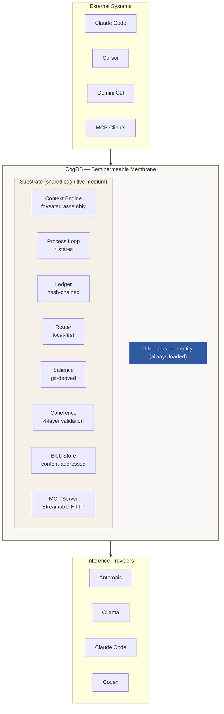

# Architecture Diagram Source

Reference for generating visual architecture diagrams.

## Diagram 1: The Cell Model (Primary)

This is the main architecture diagram. Shows CogOS as a cell with organelles in a shared substrate.

### ASCII Version

```
                    ╭─── External Systems ───╮
                    │  Claude Code  Cursor    │
                    │  Gemini CLI   MCP       │
                    │  OpenAI API   Webhooks  │
                    ╰──────────┬─────────────╯
                               │
        ┏━━━━━━━━━━━━━━━━━━━━━━▼━━━━━━━━━━━━━━━━━━━━━━━━┓
        ┃            MEMBRANE (semipermeable)              ┃
        ┃  ┄┄┄┄┄┄┄┄┄┄┄┄┄┄┄┄┄┄┄┄┄┄┄┄┄┄┄┄┄┄┄┄┄┄┄┄┄┄┄┄┄  ┃
        ┃                                                  ┃
        ┃            ╭━━━━━━━━━━━━━━╮                      ┃
        ┃            ┃   NUCLEUS    ┃                      ┃
        ┃            ┃   Identity   ┃                      ┃
        ┃            ┃   Always     ┃                      ┃
        ┃            ┃   Loaded     ┃                      ┃
        ┃            ╰━━━━━━━━━━━━━━╯                      ┃
        ┃                                                  ┃
        ┃    ╭────────────╮  ╭────────────╮                ┃
        ┃    │  Context   │  │  Process   │                ┃
        ┃    │  Engine    │  │  Loop      │                ┃
        ┃    │            │  │            │                ┃
        ┃    │  foveated  │  │  active    │                ┃
        ┃    │  assembly  │  │  receptive │                ┃
        ┃    │  4 zones   │  │  consolidate                ┃
        ┃    ╰────────────╯  │  dormant   │                ┃
        ┃                    ╰────────────╯                ┃
        ┃  ╭─────────╮ ╭──────────╮ ╭──────────╮          ┃
        ┃  │ Ledger  │ │  Router  │ │ Salience │          ┃
        ┃  │ hash-   │ │  local-  │ │ git-     │          ┃
        ┃  │ chained │ │  first   │ │ derived  │          ┃
        ┃  ╰─────────╯ ╰──────────╯ ╰──────────╯          ┃
        ┃  ╭─────────╮ ╭──────────╮ ╭──────────╮          ┃
        ┃  │Coherence│ │  Blob    │ │   MCP    │          ┃
        ┃  │ 4-layer │ │  Store   │ │  Server  │          ┃
        ┃  ╰─────────╯ ╰──────────╯ ╰──────────╯          ┃
        ┃                                                  ┃
        ┃  · · · · · · · · SUBSTRATE · · · · · · · · · ·  ┃
        ┃  · · · (shared medium / cytoplasm) · · · · · ·  ┃
        ┃  · · · · · · · · · · · · · · · · · · · · · · ·  ┃
        ┃                                                  ┃
        ┃  ┄┄┄┄┄┄┄┄┄┄┄┄┄┄┄┄┄┄┄┄┄┄┄┄┄┄┄┄┄┄┄┄┄┄┄┄┄┄┄┄┄  ┃
        ┗━━━━━━━━━━━━━━━━━━━━━━━━━━━━━━━━━━━━━━━━━━━━━━━━┛
                               │
                    ╭──────────▼─────────────╮
                    │  Providers              │
                    │  Anthropic · Ollama     │
                    │  Claude Code · Codex    │
                    ╰────────────────────────╯
```

### Key visual principles for the generated image:
- The **membrane** should look biological — not a hard rectangle, more like a cell wall
- **Organelles** float in the substrate, they're NOT stacked or layered
- The **nucleus** is central and prominent — it's the identity core
- The **substrate** should feel like a medium — dots, texture, or subtle pattern
- **No arrows between organelles** — they communicate through the substrate, not directly
- External systems are OUTSIDE the membrane
- Providers are also outside but below — they're capabilities the cell can reach
- Color palette: warm neutrals, maybe with the nucleus in a distinct accent color

### Mermaid Version (GitHub fallback)



---

## Diagram 2: The Foveated Context Zones

```
    ┌─────────────────────────────────────────┐
    │           Zone 0: NUCLEUS               │  ← always present
    │           identity · self-model          │     never evicted
    ├─────────────────────────────────────────┤
    │           Zone 1: KNOWLEDGE             │  ← shifts slowly
    │           CogDocs · indexed memory       │     high cache hit
    ├─────────────────────────────────────────┤
    │           Zone 2: HISTORY               │  ← scored, evictable
    │           conversation turns             │     relevance + recency
    ├─────────────────────────────────────────┤
    │           Zone 3: CURRENT               │  ← always present
    │           the current message            │     
    ├═════════════════════════════════════════┤
    │           [OUTPUT RESERVE]              │  ← reserved for
    │           model generation               │     generation
    └─────────────────────────────────────────┘

    Stable ──────────────────────────── Volatile
    (top stays in KV cache)      (bottom changes per request)
```

---

## Diagram 3: The Scale Invariance (Fractal)

```
    Scale 0: Block
    ┌─────┐ fork ──→ ┌──┐┌──┐  merge ──→ ┌─────┐
    │block│          │b1││b2│             │block'│
    └─────┘          └──┘└──┘             └─────┘

    Scale 1: Thread
    ┌──────────┐ /btw ──→ ┌──────┐  fold back ──→ ┌──────────┐
    │  main    │          │ side │                 │  main'   │
    │  thread  │          │thread│                 │  thread  │
    └──────────┘          └──────┘                 └──────────┘

    Scale 2: Agent
    ┌──────────┐ spawn ──→ ┌────────┐  commit ──→ ┌──────────┐
    │  parent  │           │subagent│             │  parent'  │
    │  process │           │worktree│             │  process  │
    └──────────┘           └────────┘             └──────────┘

    Scale 3: Workspace
    ┌──────────┐ branch ──→ ┌────────┐  PR ──→ ┌──────────┐
    │   main   │            │feature │         │  main'   │
    └──────────┘            └────────┘         └──────────┘

    Same operation at every scale:
      fork (create distinction)
      merge (resolve distinction)
      die (distinction wasn't worth keeping)
```
