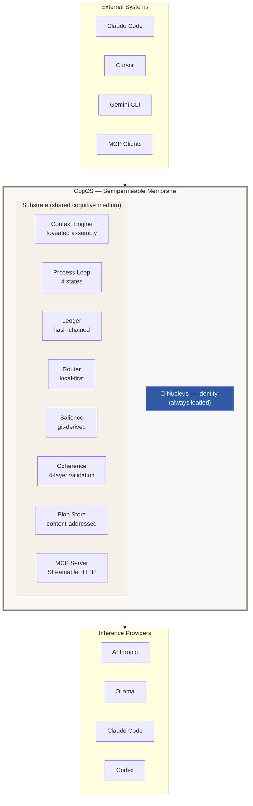

# Architecture Diagram Source

Reference for generating visual architecture diagrams.

## Diagram 1: The Cell Model (Primary)

This is the main architecture diagram. Shows CogOS as a cell with organelles in a shared substrate.

### ASCII Version

```
                    ╭─── External Systems ───╮
                    │  Claude Code  Cursor    │
                    │  Gemini CLI   MCP       │
                    │  OpenAI API   Webhooks  │
                    ╰──────────┬─────────────╯
                               │
        ┏━━━━━━━━━━━━━━━━━━━━━━▼━━━━━━━━━━━━━━━━━━━━━━━━┓
        ┃            MEMBRANE (semipermeable)              ┃
        ┃  ┄┄┄┄┄┄┄┄┄┄┄┄┄┄┄┄┄┄┄┄┄┄┄┄┄┄┄┄┄┄┄┄┄┄┄┄┄┄┄┄┄  ┃
        ┃                                                  ┃
        ┃            ╭━━━━━━━━━━━━━━╮                      ┃
        ┃            ┃   NUCLEUS    ┃                      ┃
        ┃            ┃   Identity   ┃                      ┃
        ┃            ┃   Always     ┃                      ┃
        ┃            ┃   Loaded     ┃                      ┃
        ┃            ╰━━━━━━━━━━━━━━╯                      ┃
        ┃                                                  ┃
        ┃    ╭────────────╮  ╭────────────╮                ┃
        ┃    │  Context   │  │  Process   │                ┃
        ┃    │  Engine    │  │  Loop      │                ┃
        ┃    │            │  │            │                ┃
        ┃    │  foveated  │  │  active    │                ┃
        ┃    │  assembly  │  │  receptive │                ┃
        ┃    │  4 zones   │  │  consolidate                ┃
        ┃    ╰────────────╯  │  dormant   │                ┃
        ┃                    ╰────────────╯                ┃
        ┃  ╭─────────╮ ╭──────────╮ ╭──────────╮          ┃
        ┃  │ Ledger  │ │  Router  │ │ Salience │          ┃
        ┃  │ hash-   │ │  local-  │ │ git-     │          ┃
        ┃  │ chained │ │  first   │ │ derived  │          ┃
        ┃  ╰─────────╯ ╰──────────╯ ╰──────────╯          ┃
        ┃  ╭─────────╮ ╭──────────╮ ╭──────────╮          ┃
        ┃  │Coherence│ │  Blob    │ │   MCP    │          ┃
        ┃  │ 4-layer │ │  Store   │ │  Server  │          ┃
        ┃  ╰─────────╯ ╰──────────╯ ╰──────────╯          ┃
        ┃                                                  ┃
        ┃  · · · · · · · · SUBSTRATE · · · · · · · · · ·  ┃
        ┃  · · · (shared medium / cytoplasm) · · · · · ·  ┃
        ┃  · · · · · · · · · · · · · · · · · · · · · · ·  ┃
        ┃                                                  ┃
        ┃  ┄┄┄┄┄┄┄┄┄┄┄┄┄┄┄┄┄┄┄┄┄┄┄┄┄┄┄┄┄┄┄┄┄┄┄┄┄┄┄┄┄  ┃
        ┗━━━━━━━━━━━━━━━━━━━━━━━━━━━━━━━━━━━━━━━━━━━━━━━━┛
                               │
                    ╭──────────▼─────────────╮
                    │  Providers              │
                    │  Anthropic · Ollama     │
                    │  Claude Code · Codex    │
                    ╰────────────────────────╯
```

### Key visual principles for the generated image:
- The **membrane** should look biological — not a hard rectangle, more like a cell wall
- **Organelles** float in the substrate, they're NOT stacked or layered
- The **nucleus** is central and prominent — it's the identity core
- The **substrate** should feel like a medium — dots, texture, or subtle pattern
- **No arrows between organelles** — they communicate through the substrate, not directly
- External systems are OUTSIDE the membrane
- Providers are also outside but below — they're capabilities the cell can reach
- Color palette: warm neutrals, maybe with the nucleus in a distinct accent color

### Mermaid Version (GitHub fallback)



---

## Diagram 2: The Foveated Context Zones

```
    ┌─────────────────────────────────────────┐
    │           Zone 0: NUCLEUS               │  ← always present
    │           identity · self-model          │     never evicted
    ├─────────────────────────────────────────┤
    │           Zone 1: KNOWLEDGE             │  ← shifts slowly
    │           CogDocs · indexed memory       │     high cache hit
    ├─────────────────────────────────────────┤
    │           Zone 2: HISTORY               │  ← scored, evictable
    │           conversation turns             │     relevance + recency
    ├─────────────────────────────────────────┤
    │           Zone 3: CURRENT               │  ← always present
    │           the current message            │     
    ├═════════════════════════════════════════┤
    │           [OUTPUT RESERVE]              │  ← reserved for
    │           model generation               │     generation
    └─────────────────────────────────────────┘

    Stable ──────────────────────────── Volatile
    (top stays in KV cache)      (bottom changes per request)
```

---

## Diagram 3: The Scale Invariance (Fractal)

```
    Scale 0: Block
    ┌─────┐ fork ──→ ┌──┐┌──┐  merge ──→ ┌─────┐
    │block│          │b1││b2│             │block'│
    └─────┘          └──┘└──┘             └─────┘

    Scale 1: Thread
    ┌──────────┐ /btw ──→ ┌──────┐  fold back ──→ ┌──────────┐
    │  main    │          │ side │                 │  main'   │
    │  thread  │          │thread│                 │  thread  │
    └──────────┘          └──────┘                 └──────────┘

    Scale 2: Agent
    ┌──────────┐ spawn ──→ ┌────────┐  commit ──→ ┌──────────┐
    │  parent  │           │subagent│             │  parent'  │
    │  process │           │worktree│             │  process  │
    └──────────┘           └────────┘             └──────────┘

    Scale 3: Workspace
    ┌──────────┐ branch ──→ ┌────────┐  PR ──→ ┌──────────┐
    │   main   │            │feature │         │  main'   │
    └──────────┘            └────────┘         └──────────┘

    Same operation at every scale:
      fork (create distinction)
      merge (resolve distinction)
      die (distinction wasn't worth keeping)
```

---

## Diagram 4: Node vs Workspace (Clarification)

The node is the runtime. The workspace is the cognitive state. They are distinct concepts.

```
    TERMINOLOGY:

    Node      = the daemon process + its membrane
                (one per machine, runs on a port)

    Workspace = the cognitive state
                (memory, identity, ledger, config)
                Can span multiple nodes (via BEP)
                Multiple can live on one node
```

### 4a: Single Node, Single Workspace (Day 1 — simplest case)

```
    ┏━━━━━━━━━━━━━━━━━━━━━━━━━━━━━━━━━━━━━━━━━━━━━┓
    ┃  Node (laptop, port 5200)                      ┃
    ┃                                                ┃
    ┃  ┌───────────────────────────────────────────┐  ┃
    ┃  │  Workspace: "my-project"                  │  ┃
    ┃  │                                           │  ┃
    ┃  │  ╭━━━━━━━━━━╮                             │  ┃
    ┃  │  ┃ Nucleus  ┃  ┌─────────┐ ┌──────────┐  │  ┃
    ┃  │  ┃ Identity ┃  │ Context │ │  Ledger  │  │  ┃
    ┃  │  ╰━━━━━━━━━━╯  │ Engine  │ │  ██████  │  │  ┃
    ┃  │                 └─────────┘ └──────────┘  │  ┃
    ┃  │  · · · · · · substrate · · · · · · · ·   │  ┃
    ┃  │  .cog/mem  .cog/config  .cog/ledger       │  ┃
    ┃  └───────────────────────────────────────────┘  ┃
    ┃                                                ┃
    ┗━━━━━━━━━━━━━━━━━━━━━━━━━━━━━━━━━━━━━━━━━━━━━┛
```

### 4b: Single Node, Multiple Workspaces

One kernel serves multiple workspaces. Each has its own identity, memory, and ledger.
The nucleus loads the active workspace's identity. Workspaces are isolated — they don't share memory unless explicitly federated.

```
    ┏━━━━━━━━━━━━━━━━━━━━━━━━━━━━━━━━━━━━━━━━━━━━━━━━━━━━━━━━━━┓
    ┃  Node (laptop, port 5200)                                   ┃
    ┃                                                             ┃
    ┃  ╭━━━━━━━━━━━━━━╮                                           ┃
    ┃  ┃   Kernel      ┃   (shared process, shared providers)     ┃
    ┃  ╰━━━━━━━━━━━━━━╯                                           ┃
    ┃       │                    │                                 ┃
    ┃  ┌────▼──────────────┐  ┌──▼───────────────────┐            ┃
    ┃  │ Workspace: "home" │  │ Workspace: "work"    │            ┃
    ┃  │                   │  │                      │            ┃
    ┃  │ Nucleus: Chaz     │  │ Nucleus: Team-Infra  │            ┃
    ┃  │ Memory: personal  │  │ Memory: work docs    │            ┃
    ┃  │ Ledger: ██████    │  │ Ledger: ██████       │            ┃
    ┃  │ .cog/             │  │ .cog/                │            ┃
    ┃  └───────────────────┘  └──────────────────────┘            ┃
    ┃                                                             ┃
    ┃  Workspaces are isolated. Different identity, different     ┃
    ┃  memory, different ledger chain. Same kernel, same          ┃
    ┃  providers.                                                 ┃
    ┗━━━━━━━━━━━━━━━━━━━━━━━━━━━━━━━━━━━━━━━━━━━━━━━━━━━━━━━━━━┛
```

### 4c: Multi-Node — Workspace Spanning Nodes (via BEP)

The same workspace replicated across multiple nodes. BEP (Block Exchange Protocol) handles replication. Each ledger block is a BEP block. Coherence ensures consistency.

```
    ┏━━━━━━━━━━━━━━━━━━━━━━━┓         ┏━━━━━━━━━━━━━━━━━━━━━━━┓
    ┃  Node A (laptop)        ┃   BEP   ┃  Node B (server)        ┃
    ┃                         ┃ ◄─────► ┃                         ┃
    ┃  ┌─────────────────┐    ┃  blocks  ┃    ┌─────────────────┐  ┃
    ┃  │ Workspace: "cog"│    ┃ ◄─────► ┃    │ Workspace: "cog"│  ┃
    ┃  │                 │    ┃         ┃    │                 │  ┃
    ┃  │ Ledger: █1█2█3  │    ┃         ┃    │ Ledger: █1█2█3  │  ┃
    ┃  │ Memory: synced  │    ┃         ┃    │ Memory: synced  │  ┃
    ┃  │ Identity: same  │    ┃         ┃    │ Identity: same  │  ┃
    ┃  └─────────────────┘    ┃         ┃    └─────────────────┘  ┃
    ┃                         ┃         ┃                         ┃
    ┃  Coherence ◄──────────────────────────► Coherence           ┃
    ┃  (validates block        ┃         ┃    (validates block     ┃
    ┃   integrity on sync)     ┃         ┃     integrity on sync)  ┃
    ┗━━━━━━━━━━━━━━━━━━━━━━━┛         ┗━━━━━━━━━━━━━━━━━━━━━━━┛

    Key:
    - BEP replicates blocks (ledger entries) between nodes
    - Each ledger block IS a BEP block — same hash, same content
    - Coherence validates integrity on both sides
    - The workspace appears identical on both nodes
    - Changes on either node propagate to the other
```

### 4d: Multi-Node, Multi-Workspace (Full Topology)

The general case: multiple nodes, each hosting one or more workspaces, with some workspaces spanning nodes.

```
    ┏━━ Node A (laptop) ━━━━━━━━━━━━┓     ┏━━ Node B (server) ━━━━━━━━━━━━┓
    ┃                                ┃     ┃                                ┃
    ┃  ┌──────────┐  ┌──────────┐   ┃     ┃   ┌──────────┐                 ┃
    ┃  │ ws:home  │  │ ws:cog   │◄──╂─BEP─╂──►│ ws:cog   │                 ┃
    ┃  │ (local   │  │ (synced) │   ┃     ┃   │ (synced) │                 ┃
    ┃  │  only)   │  └──────────┘   ┃     ┃   └──────────┘                 ┃
    ┃  └──────────┘                 ┃     ┃                                ┃
    ┗━━━━━━━━━━━━━━━━━━━━━━━━━━━━━━┛     ┃   ┌──────────┐                 ┃
                                          ┃   │ ws:api   │                 ┃
                                          ┃   │ (local   │                 ┃
                                          ┃   │  only)   │                 ┃
                                          ┃   └──────────┘                 ┃
                                          ┗━━━━━━━━━━━━━━━━━━━━━━━━━━━━━━┛

    - ws:home lives only on Node A (personal, never synced)
    - ws:cog spans both nodes (synced via BEP)
    - ws:api lives only on Node B (server-only workload)
    - Each workspace has its own identity, memory, ledger
    - BEP only syncs workspaces that are explicitly federated
```

### Visual principles for multi-node diagrams:
- Nodes should look like distinct cells / membranes
- BEP connections should look like channels or bridges between cells
- Workspaces within a node should look like compartments or vacuoles
- Synced workspaces should be visually linked across nodes (same color/label)
- Local-only workspaces should be visually distinct (no external connections)
- The overall layout should suggest a network of cells, not a centralized architecture
